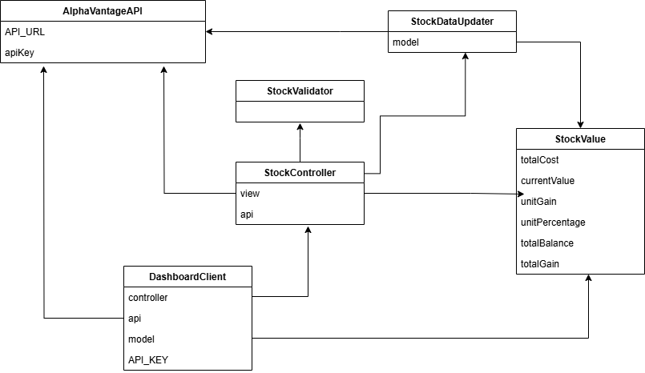

# Modelo de Dominio - Stock Management

## Introducción

Este documento describe el modelo de dominio para la aplicación de gestión de acciones Stock Management. El objetivo es proporcionar una visión clara de los elementos clave y sus relaciones dentro del sistema.

## Entidades Principales

En la siguiente imagen se muestra el modelo del dominio del futuro producto software:

